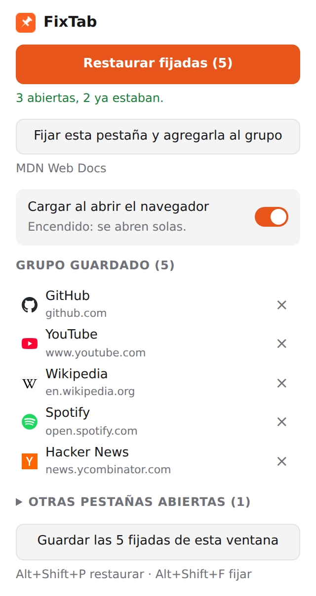

<div align="center">


# FixTab

**Tus pestañas fijadas, de vuelta con un clic.**

Guarda las pestañas que siempre tienes fijadas y recupéralas con un botón, un atajo de teclado o
solas al abrir el navegador.

[](https://chromewebstore.google.com/detail/fixtab/kfehbcfiobolppdoadgjohhbpoppikhf)
[](https://github.com/reiterstahl/fixtab/actions/workflows/ci.yml)


[](LICENSE)

**[Agregar a Chrome — es gratis](https://chromewebstore.google.com/detail/fixtab/kfehbcfiobolppdoadgjohhbpoppikhf)**

[English](README.md) · **Español**

<picture>
  <source media="(prefers-color-scheme: dark)" srcset="docs/images/popup-es-dark.png" />
  
</picture>

</div>

## Para qué

Las pestañas fijadas son las que quieres tener abiertas siempre: correo, calendario, chat,
música. También son fáciles de perder. Un cierre inesperado, un perfil nuevo, cerrar todas las
ventanas en un Mac o una restauración que trae la sesión equivocada, y toca volver a fijarlo todo
a mano.

FixTab recuerda ese conjunto por ti y lo pone de vuelta en su sitio.

## Qué hace

- **Guardar con un clic.** Fija tus pestañas, abre FixTab y pulsa **Guardar las fijadas de esta
  ventana**.
- **Restaurar sin duplicados.** Las que faltan se abren fijadas, las que ya están abiertas pero
  sueltas se fijan, las que ya estaban no se tocan, y todo vuelve al orden guardado.
- **Cargar al abrir el navegador** (encendido por defecto). También funciona si el navegador
  siguió corriendo en segundo plano y solo abres una ventana nueva (macOS, o Windows con
  aplicaciones en segundo plano). Apágalo y FixTab solo restaura cuando se lo pides.
- **Fijar desde FixTab.** Un botón fija la pestaña en la que estás y la agrega al grupo, así queda
  recordada para la próxima vez. Una lista plegable hace lo mismo con cualquier otra pestaña
  abierta, y si fijaste pestañas a mano FixTab te avisa que aún no están en el grupo y las agrega
  con un clic.
- **Atajos de teclado y clic derecho.** <kbd>Alt</kbd>+<kbd>Shift</kbd>+<kbd>P</kbd> restaura y
  <kbd>Alt</kbd>+<kbd>Shift</kbd>+<kbd>F</kbd> fija la pestaña actual y la agrega al grupo, ambos
  sin abrir el popup. «Fijar esta pestaña y agregarla a FixTab» también está en el menú del clic
  derecho de la página. Los atajos se cambian en `chrome://extensions/shortcuts`.
- **Sigue redirecciones.** Si `gmail.com` termina en `mail.google.com/mail/u/0/`, FixTab recuerda
  ambas y reconoce la pestaña de cualquiera de las dos formas.
- **Se sincroniza con tu navegador.** El grupo se guarda en el almacenamiento sincronizado del
  propio navegador.
- **En inglés y español.** Sigue el idioma de tu navegador.
- **Privada.** Sin cuentas, sin analíticas, sin peticiones de red. Ver [PRIVACY.md](PRIVACY.md).

## Instalar

### Chrome Web Store (recomendado)

**[Instala FixTab desde la Chrome Web Store](https://chromewebstore.google.com/detail/fixtab/kfehbcfiobolppdoadgjohhbpoppikhf)** y pulsa **Agregar a Chrome**. Se actualiza
sola. El mismo enlace sirve en Brave, Opera, Vivaldi y otros navegadores basados en Chromium; Edge pide
antes permitir extensiones de otras tiendas.

### Desde el código (Chrome, Edge, Brave, Arc, Opera, Vivaldi…)

1. Descarga el último `fixtab-x.y.z.zip` desde
   [Releases](https://github.com/reiterstahl/fixtab/releases) y descomprímelo, o clona el repo.
2. Abre la página de extensiones del navegador (`chrome://extensions`, `edge://extensions`,
   `brave://extensions`…).
3. Activa el **Modo de desarrollador**.
4. Pulsa **Cargar descomprimida** y elige la carpeta descomprimida, o la carpeta `extension/` del
   repo.
5. Fija el ícono de FixTab en la barra.

Para actualizar una instalación desde el código: reemplaza los archivos (o `git pull`) y pulsa ↻
en la tarjeta de FixTab.

## Cómo funciona

| Paso           | Qué hace FixTab                                                                                                                                                                                                                                                 |
| -------------- | --------------------------------------------------------------------------------------------------------------------------------------------------------------------------------------------------------------------------------------------------------------- |
| **Guardar**    | Lee las pestañas fijadas de la ventana actual, en orden, y guarda sus URLs y títulos como _el_ grupo. Si ya existe uno, pide confirmación antes de reemplazarlo.                                                                                                |
| **Restaurar**  | Por cada pestaña guardada: la deja si ya está fijada, la fija si está abierta pero suelta, o la abre fijada. Luego las mueve a la izquierda en el orden guardado. Las fijadas que no son del grupo quedan después.                                              |
| **Reconocer**  | Compara URLs sin el `#fragmento` y sin la `/` final. La primera vez que FixTab abre una pestaña anota a dónde terminó (`finalUrl`), así una pestaña redirigida se reconoce la próxima vez. Pasa el mouse por una entrada para ver ambas.                        |
| **Al iniciar** | Con `runtime.onStartup`, y cuando se abre la primera ventana normal sin que hubiera ninguna, FixTab espera a que el número de pestañas deje de cambiar (1,5 s estable, 10 s máximo) para no duplicar la sesión que el navegador está restaurando por su cuenta. |

Si algo falla sin el popup abierto (al iniciar o con el atajo), el ícono de la barra muestra un
**!** rojo y el motivo al pasar el mouse.

## Permisos

| Permiso        | Para qué                                                                                                                                  |
| -------------- | ----------------------------------------------------------------------------------------------------------------------------------------- |
| `tabs`         | Leer las URLs y títulos de las pestañas de la ventana actual para guardarlas o fijarlas; abrir, fijar y mover pestañas para restaurarlas. |
| `storage`      | Guardar el grupo y el switch de inicio (`storage.sync`), y un mapa temporal de las pestañas que están cargando (`storage.session`).       |
| `favicon`      | Mostrar el ícono de cada sitio en el popup, tomado de la caché de favicons del propio navegador.                                          |
| `contextMenus` | Agregar «Fijar esta pestaña y agregarla a FixTab» al menú del clic derecho.                                                               |

Sin permisos de host, sin content scripts, sin código remoto.

## Desarrollo

Sin build: la carpeta `extension/` es exactamente lo que carga el navegador.

```sh
pnpm install
pnpm exec playwright install chromium   # solo la primera vez, para el e2e
pnpm verify                             # formato + tipos + unitarios + e2e
```

| Comando         | Qué hace                                                                                       |
| --------------- | ---------------------------------------------------------------------------------------------- |
| `pnpm test`     | Tests unitarios (Vitest): plan de restauración, comparación de URLs, traducciones.             |
| `pnpm test:e2e` | Chromium real con la extensión cargada, contra un servidor HTTP local.                         |
| `pnpm check`    | Chequeo de tipos del JavaScript con TypeScript (`checkJs` + JSDoc).                            |
| `pnpm format`   | Prettier.                                                                                      |
| `pnpm zip`      | Empaqueta `extension/` en `dist/fixtab-<versión>.zip` para la Chrome Web Store.                |
| `pnpm assets`   | Regenera las capturas del README y las imágenes de la tienda (necesita red para los favicons). |

```
extension/
  manifest.json          Manifest V3
  background.js          service worker: arranque, restauración, redirecciones, atajo
  popup.html/.css/.js    el popup
  lib/plan.js            lógica pura: qué abrir, fijar o dejar (con tests)
  lib/store.js           configuración en chrome.storage.sync
  lib/i18n.js            ayudas de chrome.i18n
  _locales/{en,es}/      traducciones
test/                    tests unitarios y la suite e2e
scripts/                 íconos, imágenes de la tienda, empaquetado
store/                   textos e imágenes de la ficha de la Chrome Web Store
```

> **Probar el arranque:** una extensión cargada con `--load-extension` se reinstala en cada
> lanzamiento y nunca recibe `runtime.onStartup`, así que el e2e llama directamente a la misma
> función de arranque (`fixtabStartupForTests`) y simula una sesión que el navegador restaura tarde.

### Agregar un idioma

1. Copia `extension/_locales/en/messages.json` a `extension/_locales/<código>/messages.json`.
2. Traduce cada `message`. Deja las claves y los bloques `placeholders` tal como están.
3. Corre `pnpm test`: falla si falta o cambia una clave o un placeholder.

### Publicar una versión

1. Sube `version` en `extension/manifest.json` y en `package.json`.
2. Crea y sube la etiqueta: `git tag v0.2.0 && git push --tags`.
3. GitHub Actions corre los tests, arma el zip y lo adjunta a un Release de GitHub.
4. Sube ese zip en el [panel de desarrollador de la Chrome Web Store](https://chrome.google.com/webstore/devconsole)
   (**Paquete → Subir nuevo paquete**) y envíalo a revisión. Los usuarios reciben la actualización
   sola cuando se aprueba.

## Hecho con

|                                                                                | Tecnología                         | Para qué                                                                 |
| ------------------------------------------------------------------------------ | ---------------------------------- | ------------------------------------------------------------------------ |
|        | Extensiones de Chrome, Manifest V3 | APIs `tabs`, `storage`, `commands`, `i18n`                               |
|          | JavaScript (módulos ES)            | Todo el código de la extensión, sin bundler ni dependencias en ejecución |
|          | TypeScript (`checkJs`)             | Chequeo de tipos del JavaScript mediante JSDoc                           |
|              | Vitest                             | Tests unitarios                                                          |
|  | Playwright                         | Tests de extremo a extremo en un Chromium real, y las capturas           |
|                | pnpm                               | Gestor de paquetes                                                       |
|            | Prettier                           | Formato                                                                  |
|       | GitHub Actions                     | CI y zips de cada versión                                                |
|              | Python + Pillow                    | Generar los íconos                                                       |

## Licencia

[MIT](LICENSE) © Rolando QR
