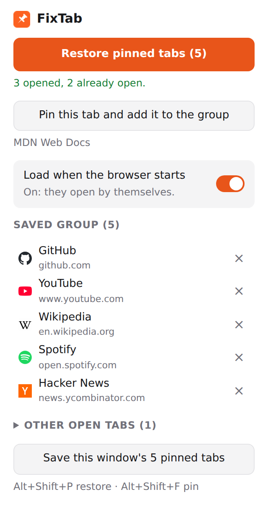

<div align="center">


# FixTab

**Your pinned tabs, back in one click.**

Save the tabs you always keep pinned, then bring them back with a button, a keyboard shortcut, or
automatically when your browser starts.

[](https://chromewebstore.google.com/detail/fixtab/kfehbcfiobolppdoadgjohhbpoppikhf)
[](https://github.com/reiterstahl/fixtab/actions/workflows/ci.yml)


[](LICENSE)

**[Add to Chrome — it's free](https://chromewebstore.google.com/detail/fixtab/kfehbcfiobolppdoadgjohhbpoppikhf)**

**English** · [Español](README.es.md)

<picture>
  <source media="(prefers-color-scheme: dark)" srcset="docs/images/popup-en-dark.png" />
  
</picture>

</div>

## Why

Pinned tabs are the ones you want open all the time: mail, calendar, chat, music. They are also
easy to lose. A crash, a new profile, closing every window on a Mac, or a restore that brings back
the wrong session, and you are pinning everything by hand again.

FixTab remembers that set for you and puts it back where it belongs.

## Features

- **Save in one click.** Pin your tabs, open FixTab, press **Save this window's pinned tabs**.
- **Restore without duplicates.** Missing tabs open pinned, loose tabs that are already open get
  pinned, the ones already there are left alone, and everything goes back to your saved order.
- **Load when the browser starts** (on by default). It also works when the browser kept running
  in the background and you just open a new window (macOS, or Windows with background apps on).
  Turn it off and FixTab only restores when you ask.
- **Pin from FixTab.** One button pins the tab you are on and adds it to the group, so it is
  remembered next time. A collapsible list does the same for any other open tab, and if you pinned
  tabs by hand FixTab tells you they are not in the group yet and adds them with one click.
- **Keyboard shortcuts and right-click menu.** <kbd>Alt</kbd>+<kbd>Shift</kbd>+<kbd>P</kbd>
  restores and <kbd>Alt</kbd>+<kbd>Shift</kbd>+<kbd>F</kbd> pins the current tab and adds it to the
  group, both without opening the popup. "Pin this tab and add it to FixTab" is also in the page's
  right-click menu. Shortcuts can be changed at `chrome://extensions/shortcuts`.
- **Follows redirects.** If `gmail.com` ends up at `mail.google.com/mail/u/0/`, FixTab remembers
  both and recognizes the tab either way.
- **Syncs with your browser.** Your group is kept in the browser's own sync storage.
- **English and Spanish.** It follows your browser's language.
- **Private.** No accounts, no analytics, no network requests. See [PRIVACY.md](PRIVACY.md).

## Install

### Chrome Web Store (recommended)

**[Install FixTab from the Chrome Web Store](https://chromewebstore.google.com/detail/fixtab/kfehbcfiobolppdoadgjohhbpoppikhf)** and click **Add to Chrome**. It updates on its
own. The same link works in Brave, Opera, Vivaldi and other Chromium browsers; Edge first asks you to allow
extensions from other stores.

### From source (Chrome, Edge, Brave, Arc, Opera, Vivaldi…)

1. Download the latest `fixtab-x.y.z.zip` from
   [Releases](https://github.com/reiterstahl/fixtab/releases) and unzip it, or clone the repo.
2. Open your browser's extensions page (`chrome://extensions`, `edge://extensions`,
   `brave://extensions`…).
3. Turn on **Developer mode**.
4. Click **Load unpacked** and choose the unzipped folder, or the `extension/` folder of the repo.
5. Pin the FixTab icon to the toolbar.

To update a source install: replace the files (or `git pull`) and press ↻ on the FixTab card.

## How it works

| Step        | What FixTab does                                                                                                                                                                                                                    |
| ----------- | ----------------------------------------------------------------------------------------------------------------------------------------------------------------------------------------------------------------------------------- |
| **Save**    | Reads the pinned tabs of the current window, in order, and stores their URLs and titles as _the_ group. If a group already exists, it asks you to confirm before replacing it.                                                      |
| **Restore** | For each saved tab: keep it if it is already pinned, pin it if it is open but loose, or open it pinned. Then it moves them to the left in the saved order. Pinned tabs that are not in the group stay after them.                   |
| **Match**   | URLs are compared without the `#fragment` and without a trailing `/`. The first time FixTab opens a tab it records where the page ended up (`finalUrl`), so a redirected tab is recognized next time. Hover an entry to see both.   |
| **Startup** | On `runtime.onStartup`, and when the first normal window opens while none were open, FixTab waits until the tab count stops changing (1.5 s stable, 10 s max) so it does not duplicate the session the browser is restoring itself. |

If something fails when there is no popup open (at startup, or with the shortcut), the toolbar icon
shows a red **!** and the reason on hover.

## Permissions

| Permission     | Why                                                                                                                      |
| -------------- | ------------------------------------------------------------------------------------------------------------------------ |
| `tabs`         | Read the URLs and titles of the tabs in the current window to save or pin them; open, pin and move tabs to restore them. |
| `storage`      | Keep your group and the startup switch (`storage.sync`), and a short-lived map of tabs being loaded (`storage.session`). |
| `favicon`      | Show each site's icon in the popup, taken from the browser's own favicon cache.                                          |
| `contextMenus` | Add the "Pin this tab and add it to FixTab" item to the right-click menu.                                                |

No host permissions, no content scripts, no remote code.

## Development

No build step: the `extension/` folder is exactly what the browser loads.

```sh
pnpm install
pnpm exec playwright install chromium   # first time only, for the e2e tests
pnpm verify                             # format + type check + unit tests + e2e
```

| Command         | What it does                                                                         |
| --------------- | ------------------------------------------------------------------------------------ |
| `pnpm test`     | Unit tests (Vitest): restore planning, URL matching, translations.                   |
| `pnpm test:e2e` | Real Chromium with the extension loaded, against a local HTTP server.                |
| `pnpm check`    | Type check the JavaScript with TypeScript (`checkJs` + JSDoc).                       |
| `pnpm format`   | Prettier.                                                                            |
| `pnpm zip`      | Package `extension/` into `dist/fixtab-<version>.zip` for the Chrome Web Store.      |
| `pnpm assets`   | Regenerate the README screenshots and the store images (needs network for favicons). |

```
extension/
  manifest.json          Manifest V3
  background.js          service worker: startup, restore, redirect tracking, shortcut
  popup.html/.css/.js    the popup
  lib/plan.js            pure logic: what to open, pin or keep (unit tested)
  lib/store.js           settings in chrome.storage.sync
  lib/i18n.js            chrome.i18n helpers
  _locales/{en,es}/      translations
test/                    unit tests and the e2e suite
scripts/                 icons, store images, packaging
store/                   Chrome Web Store listing text and images
```

> **Testing startup:** an extension loaded with `--load-extension` is reinstalled on every launch and
> never receives `runtime.onStartup`, so the e2e suite calls the same startup function directly
> (`fixtabStartupForTests`) and simulates a session that the browser restores late.

### Adding a language

1. Copy `extension/_locales/en/messages.json` to `extension/_locales/<code>/messages.json`.
2. Translate every `message`. Keep the keys and the `placeholders` blocks exactly as they are.
3. Run `pnpm test`. It fails if a key or a placeholder is missing or different.

### Releasing

1. Bump `version` in both `extension/manifest.json` and `package.json`.
2. Tag and push: `git tag v0.2.0 && git push --tags`.
3. GitHub Actions runs the tests, builds the zip and attaches it to a GitHub Release.
4. Upload that zip in the [Chrome Web Store developer dashboard](https://chrome.google.com/webstore/devconsole)
   (**Package → Upload new package**) and submit it for review. Users get the update automatically once
   it is approved.

## Built with

|                                                                                | Technology                     | Used for                                                            |
| ------------------------------------------------------------------------------ | ------------------------------ | ------------------------------------------------------------------- |
|        | Chrome Extensions, Manifest V3 | `tabs`, `storage`, `commands`, `i18n` APIs                          |
|          | JavaScript (ES modules)        | All the extension code, with no bundler and no runtime dependencies |
|          | TypeScript (`checkJs`)         | Type checking the JavaScript through JSDoc                          |
|              | Vitest                         | Unit tests                                                          |
|  | Playwright                     | End-to-end tests in a real Chromium, plus the screenshots           |
|                | pnpm                           | Package manager                                                     |
|            | Prettier                       | Formatting                                                          |
|       | GitHub Actions                 | CI and release zips                                                 |
|              | Python + Pillow                | Generating the icons                                                |

## License

[MIT](LICENSE) © Rolando QR
